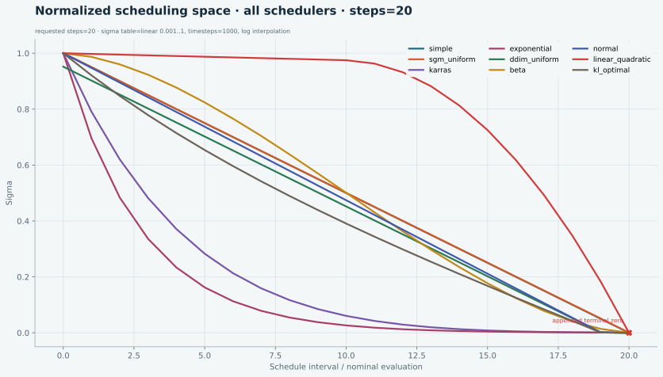

# ComfyUI Scheduler Visualizer

An interactive, generated reference for every scheduler in ComfyUI's built-in `SCHEDULER_NAMES` registry.

**Live site:** [zironic.github.io/ComfyUI-Scheduler-Reference](https://zironic.github.io/ComfyUI-Scheduler-Reference/)

[](https://zironic.github.io/ComfyUI-Scheduler-Reference/)

The visualizer compares linear sigma, log sigma, and signed sigma drop across four explicit model-sampling regimes:

- **Normalized scheduling space** — a declared canonical 1,000-point sigma table from `0.001` to `1`. This makes scheduler policy comparable without pretending every scheduler is model-independent.
- **Flow / MiniMax H3 video** — `ModelSamplingDiscreteFlow`, `shift=12`, `multiplier=1000`. H3's separately shifted audio stream is not plotted.
- **Krea 2** — `ModelSamplingFlux`, `shift=1.15`, `timesteps=10000`.
- **Classic SD / SDXL** — `ModelSamplingDiscrete`, linear beta schedule, `linear_start=0.00085`, `linear_end=0.012`, `timesteps=1000`.

The default plots use `steps=20`. The site can interactively show requested step counts from 2 through 50 and switch sigma between linear and symmetric-log scales. The “Log + 0” view is logarithmic above `1e-3`, then uses a short linear zone down to the appended terminal zero so every curve visibly terminates without adding another empty decade. Every scheduler card links to its exact function in the pinned ComfyUI revision and to reusable SVG and PNG assets.

## What “evaluation” means here

The horizontal axis is a scheduler interval or nominal evaluation. Most schedules contain `steps + 1` sigma values, with the final zero defining the last transition. Solver choice can add model calls—Heun and DPM2 are simple examples—so this visualizer does not claim to be a universal NFE counter.

`Δsigma` is the signed drop:

```text
σᵢ − σᵢ₊₁
```

The final transition to zero is included.

## Rebuild

The ComfyUI source revision is pinned in [`COMFYUI_COMMIT`](COMFYUI_COMMIT). Check out that exact revision, install the plotting dependencies, then run:

```powershell
python -m pip install -r requirements.txt
python generate.py --comfy-source path\to\ComfyUI
python -m unittest -v test_reference.py
```

`generate.py` refuses to run against a different ComfyUI revision. It also verifies the scheduler registry and the MiniMax H3 and Krea 2 sampling settings before writing:

- `data/schedules.json` — complete machine-readable data for steps 2–50.
- `data/schedules.js` — the same dataset for the dependency-free static site.
- `assets/<regime>/` — default `steps=20` SVG and PNG plots for all schedulers and each scheduler separately.

The Pages workflow rebuilds everything from the pin, checks that committed outputs are current, runs the focused tests, and deploys the static repository.

## Provenance and license

Scheduler formulas are small, explicit reimplementations of the linked ComfyUI functions. ComfyUI is GPL-3.0; this repository is GPL-3.0-or-later. Source links are revision-pinned so the plotted behavior and the referenced code cannot silently drift apart.
